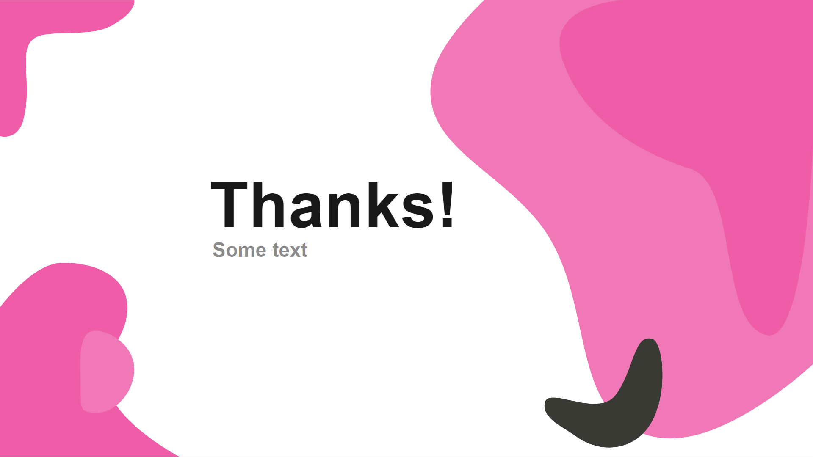

# slidev-theme-zhozhoba

[](https://www.npmjs.com/package/slidev-theme-zhozhoba)

A zhozhoba theme for [Slidev](https://github.com/slidevjs/slidev).

This theme is inspired by the Basic Black/White theme:
light theme            |  dark theme
:-------------------------:|:-------------------------:
  |  


<!--
run `npm run dev` to check out the slides for more details of how to start writing a theme
-->

<!--
put some screenshots here to demonstrate your theme,
-->

<!-- 
Live demo: [...]
-->

## Install

Add the following frontmatter to your `slides.md`. Start Slidev then it will prompt you to install the theme automatically.

<pre><code>---
theme: <b>zhozhoba</b>
---</code></pre>

Learn more about [how to use a theme](https://sli.dev/themes/use).

## Layouts

This theme provides the following layouts:
---
### Cover
Usage: 
```
---
theme: zhozhoba
layout: cover
company: COMPANY NAME (optional)
date: 12.05.2021 (optional)
---
```
<div align="center">
  
</div>

---

### Content-1
Usage: 
```
---
layout: content-1
---
```
<div align="center">
  
</div>

---

### Section-1
Usage: 
```
---
layout: section-1
---
```
<div align="center">
  
</div>

---

### Section-2
Usage: 
```
---
layout: section-2
---
```
<div align="center">
  
</div>

---

### Content-2
Usage: 
```
---
layout: content-2
---
```
<div align="center">
  
</div>

---

### Image
Usage: 
```
---
layout: image-side
image: 'image-url'
---
```
<div align="center">
  
</div>

---

### End
Usage: 
```
---
layout: end
---
```
<div align="center">
  
</div>

---


## Contributing

- `npm install`
- `npm run dev` to start theme preview of `example.md`
- Edit the `example.md` and style to see the changes
- `npm run export` to genreate the preview PDF
- `npm run screenshot` to genrate the preview PNG
